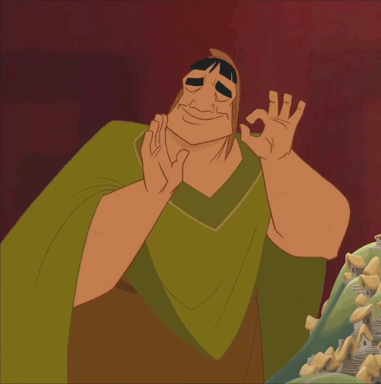
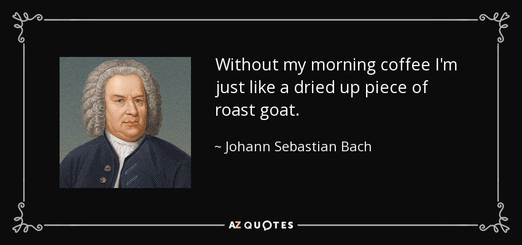

# CHORDS-driver :musical_keyboard:

*CHORDS*: A Linux kernel module for generating text of musical chord spellings based on given parameters.
This was made as a fun sample project for students to borrow as an example. With that said, this is also my own learning experience with music theory. Bare with me :smiley:



> [!WARNING]  
> Not supporting flats (♭), double flats (♭♭), or double sharps (♯♯) at this time... sorry!

## Installation :hammer_and_wrench:

If MAKE is not installed
```bash
sudo apt install make
```

### Run script
```bash
./createModule.sh
```

### OR follow these steps in the terminal
```bash
make all
sudo insmod chords.ko
sudo dmesg | tail -n 4
sudo mknod /dev/chords210 c 240 0
```

"dmesg" will show the major number at the bottom if insmod ran successfully. replace "240" with that number if it is different.

## Testing :test_tube:

### Run test script
```bash
./testChords.sh
```

### OR follow these steps in the terminal
```bash
sudo rm chords_test  # if need to recompile
sudo make chords_test
gcc $< -o $@
```

## Usage :gear:

### Initialize :rocket:
Initialize file descriptor and string that contains chord.
By default, CHORDS supports an input string of ***16 bytes***.
```code
int fd;
char *s = "Em7S2A11/B";
```

### Open :open_file_folder:
Open the file 
```code
fd = open("/dev/chords", O_RDWR);
if (fd < 0) {
  perror("open");
  return fd;
}
```

### Write :writing_hand:
Write to the file to send the chord name to the device driver.
By default, CHORDS supports an output string of ***32 bytes***.
```code
int length = write(fd, s, strlen(s));
if (length < 0) {
  perror("write");  
}
```

### Read :open_book:
Read from the file to retrieve the chord spelling from the device driver.
```code
    char result[32] = {0};
    read(fd, result, sizeof(result));
    printf("Result from driver: %s\n", result);
```

### Close :file_folder:
Nobody likes untidy processes. Close the file when you are done.
```code
close(fd);
return 0;
```

## <a name="section-syntax"></a> Input Chord Name Syntax :notes:

In the example, we write:
```code
char *s = "Em7S2A11/B";
```
This string represents the chord E minor 7 sus 2 add 11 / B
The goal of this device driver is to allow anyone to simply type their chord name in the application to recieve a string value.
The syntax to create your own chords is as follows:

> ***Note***&rarr;***Scale***&rarr;***7th***&rarr;***Sus{2/4}***&rarr;***Add{n}***&rarr;***/{c}***

In that example, *d = one or two-digit int* and *c = Note char*. *2/4* means choose either 2 OR 4.

Below is how you would convert a human readable chord into a CHORDS-readable chord.
| Input  | SYNTAX SYMBOLS |
| ------------- | ------------- |
| ***Note***  | (See the next table)  |
| Scale  | (omit), M, m, +, O, 0  |
| 7th Note  | 7  |
| Suspended 2nd/4th Note  | S{2/4}  |
| Added or Extended Note | A{d}|
| Slash or Inversion | /{c}

> [!IMPORTANT]  
>  The only required symbol is the ***Note*** symbol. Every other symbol may be added or removed from your chord as needed.

> [!CAUTION]  
>  ORDER MATTERS. Rearranging these will alter the expected output. Refer to the top of section [Input Chord Name Syntax](#section-syntax) for the syntax.

### <a name="section-syntax-notes"></a> Notes :musical_note:
There are 12 possible note symbols.
This app does not support flats (♭), double flats (♭♭), or double sharps (♯♯) at this time. Consider converting to sharps (♯) instead.

| Note  | SYNTAX SYMBOLS |
| ------------- | ------------- |
| C  | C  |
| C♯, D♭  | C#  |
| D  | D  |
| D♯, E♭  | D#  |
| E | E |
| F | F |
| F♯, G♭ | F# |
| G  | G  |
| G♯, A♭  | G#  |
| A  | A  |
| A, B♭  | A#  |
| B  | B  |

> [!IMPORTANT]  
>  The only required symbol is the ***Note*** symbol. Every other symbol may be added or removed from your chord as needed.

### Scales/Modes :musical_score:
There are 4 possible scales in this system.
They are the scales used for deriving the appropriate notes for the chord provided.

| Scale  | SYNTAX SYMBOLS | Description |
| ------------- | ------------- | ------------- |
| Major, M, maj, △ | (omit), M  | I'm lying about "M" (see warning) |
| Minor, m, min, - | m | lowercase-sensitive |
| Augmented, aug, +  | + | "Augie doggy, my son, you can only use the + symbol" | 
| Diminished, dim, ° | O | That is the CAPITAL letter "O" |
| Half-Diminished, ø | 0 | That is the Zero a.k.a. the number "0" |

> [!WARNING]  
> Although you can technically pass any character that is not recognized by the system to set the scale to Major, please DON'T! :grimacing:

### 7ths, Suspensions, Adds and Extensions, and Slashes (Inversions) :tada:
The preceding steps set up triad chords. Throw these at your chords for more flavor. They will either add more notes or alter thirds and fifths.

| Extra Notes  | SYNTAX SYMBOLS | Description |
| ------------- | ------------- | ------------- |
| 7th Note  | 7  | The 7th note of your scale is the life of your party! ***7th note will be added to a triad...*** which will make it a quad now I guess.|
| Suspended 2nd Note  | S2  | The 2nd note of your scale feels sad it wasn't invited to the jam as a *before*thought.  ***Suspended 2nd will replace the 3rd note of the original triad.*** |
| Suspended 4th Note  | S4  | The 4th note of your scale was only invited because the 2nd note and 3rd note couldn't make it.  ***Suspended 4th will replace the 3rd note of the original triad.*** |
| Added or Extended Note | A{d}| Who doesn't like party crashers? You'll never know what to expect with them around!  ***Adds a note (presumably one octave higher than the root), to the chord.*** |
| Slash or Inversion | /{c} | The guest that steals your thunder... can't blame them for being so *bass*.  ***Adds a bass note to the front of the chord. May move a 3rd note or a 5th note instead.*** |

> [!NOTE]  
> {c} represents any character as long as it is  Refer to the top of section [Notes](#section-syntax-notes) for the list of Note symbols.

> [!NOTE]  
> {d} represents a single or two-digit number. This means the chord name could contain *A9* or *A13*. Sure you can technically create a ***EmA99*** chord in this system, but WWBJSD?



## Expected Outputs :musical_keyboard:
Here are some samples of the expected output from certain inputs.
| Input  | Output | Description |
| ------------- | ------------- | ------------- |
| E | E-G#-B | E major triad |
| ES2 | E-F#-B | E suspended 2nd chord |
| ES4 | E-A-B | E suspended 4th chord |
| E+ | E-G#-C | E augmented chord |
| EO | E-G#-A# | E diminished chord. A# would normally be Bb |
| E0 | E-G-A#-D | E half-diminished chord. A# would normally be Bb |
| Em | E-G-B | E minor triad |
| Em7 | E-G-B-D | E minor 7th chord |
| EmA9 | E-G-B-D-F# | E minor 9th chord |
| EmA13 | E-G-B-D-C | E minor 13th chord |
| Em/G | G (bass)-E-D | E minor 1st inversion |
| Em/B | B (bass)-E-G | E minor 2nd inversion |

### Notes on excluded symbols
Certain symbols, like *6*, is omitted because *A6* functions the same.

## Contributing :handshake:

Pull requests are welcome. For major changes, please open an issue first
to discuss what you would like to change.
Please make sure to update tests as appropriate.

## License :call_me_hand:

[GPL](https://choosealicense.com/licenses/GPL/)

## Credits :star2:
Project and project description Copyright (c) 2025 by TonyOM. All rights reserved.